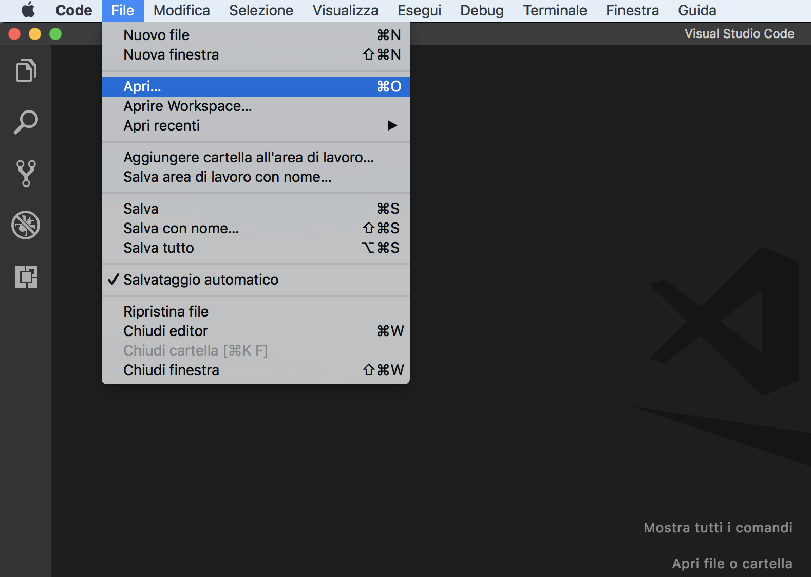

# 01-comincia-a-preparare-il-tuo-progetto 

|                                            | Capitolo successivo                                                                    |
| :----------------------------------------- | -------------------------------------------------------------------------------------: |
| [◀︎ 00-installazione](../00-installazione) | [02-inizia-a-personalizzare-il-template ▶︎](../02-inizia-a-personalizzare-il-template) |

## Obiettivo: 

Creare la base del nostro documento HTML, un file con estensione `.html`

- Per comodità crea una cartella vuota, puoi chiamarla `mywebsite`
- Apri **Visual Studio Code** e apri la cartella con `File > Apri…`

<kbd></kbd>

- Crea un file `index.html`
- Vai sul sito di [Bulma](https://bulma.io/documentation/overview/start/) e copia lo **Starter template** nel file `index.html` appena creato

<kbd></kbd>

> Come puoi vedere un documento HTML è composto da due parti principali, una parte superiore chiamata 'head' (testa) e una parte inferiore chiamata "body" (corpo).
>
>
> L'head contiene il titolo della pagina ("title", per intenderci, quello in alto quando apri una nuova scheda nel browser), link esterni, gli stili e altre informazioni per il corretto funzionamento della pagina.
Infatti, per utilizzare Bulma oggi, inseriamo il suo link proprio all'interno della sezione head.
>
>
>Il body contiene invece tutto ciò che sarà visibile, come il i titoletti, i paragrafi, le immagini, ecc.

- Vai nella cartella `mywebsite`, con il tasto destro apri con un browser `index.html` per visualizzare la pagina.

### Come puoi vedere hai appena creato una pagina web 😍

<kbd></kbd>

|                                           | Capitolo successivo                                                                    |
| :---------------------------------------- | -------------------------------------------------------------------------------------: |
| [◀ 00-installazione](../00-installazione) | [02-inizia-a-personalizzare-il-template ▶︎](../02-inizia-a-personalizzare-il-template) |
