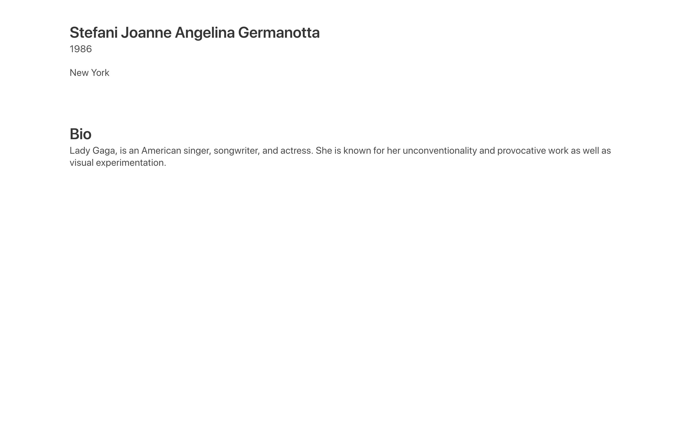

# 03-modifica-il-layout

| Capitolo precedente  | Capitolo successivo     |
| :--------------- | ---------------: |
| [◀︎ 02-inizia-a-personalizzare-il-template](../02-inizia-a-personalizzare-il-template)| [04-aggiungi-le-prime-icone ▶︎](../04-aggiungi-le-prime-icone) |

## Obiettivo: 

Modifichiamo il layout della pagina

> Come avrai notato, la maggior parte dei tag hanno un tag di apertura e uno di chiusura
>
> Oltre ai tag per formattare il testo ci sono quelli veri propri per modificare il layout.
> 
> Ad esempio `div` e `section` sono contenitori che contengono altri elementi e permetto di dividere in sezioni la pagina.

* Creare una nuova `section`, cioè un blocco distinto all'interno della pagina.

* Dentro creare un `div` con classe `container`, che è una classe di Bulma che ti permette di centrare il 
contenuto orizzontalmente

All'interno del `container` inseririsci i tuoi dati:

* Crea un titolo con il tag `h1` e inserisci il tuo nome
* Crea un paragrafo con il tag `p`  con il tuo anno di nascita
* Crea un paragrafo con il tag `p`  con il luogo di nascita

> Se vuoi sperimentare, ci sono in tutto 6 grandezze per le intestazioni dalla 1 alla 6 `h1`, `h2`, `h3`...

<kbd></kbd>

| Capitolo precedente  | Capitolo successivo     |
| :--------------- | ---------------: |
| [◀︎ 02-inizia-a-personalizzare-il-template](../02-inizia-a-personalizzare-il-template)| [04-aggiungi-le-prime-icone ▶︎](../04-aggiungi-le-prime-icone) |
