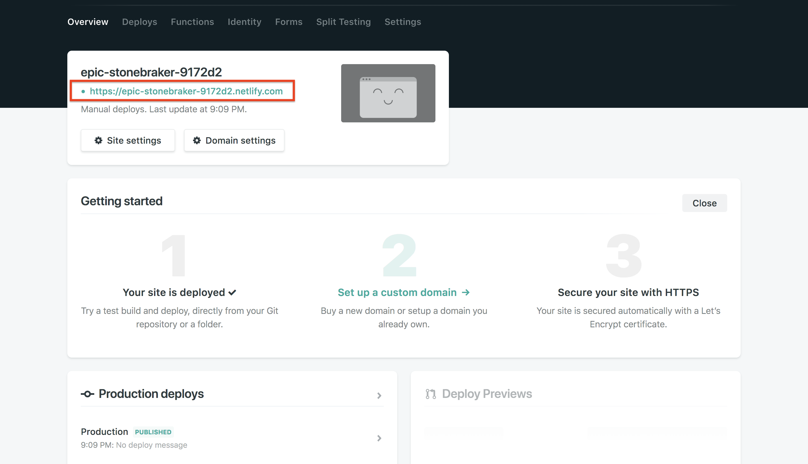
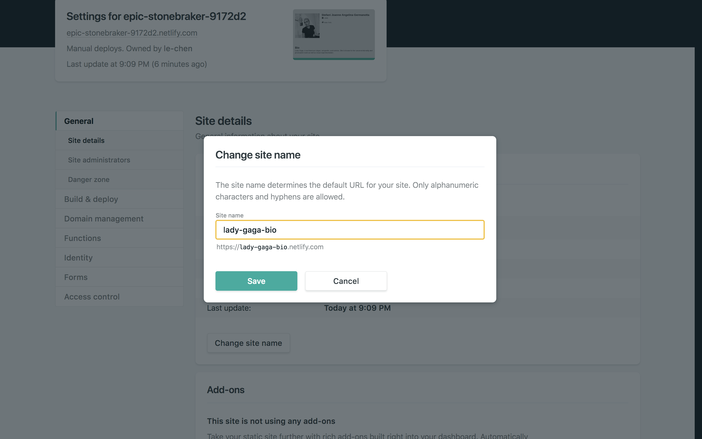

# 10-carica-online

| Capitolo precedente                                                  | Torna all'introduzione                                                        |
| :------------------------------------------------------------------- | ----------------------------------------------------------------------------: |
| [◀︎ ︎︎09-crea-una-sezione-contatti](../09-crea-una-sezione-contatti) | [Introduzione ▶︎](https://github.com/voxel-community/2021-metti-online-sito-web/) |

## Obiettivo: 
Caricare online il sito che hai creato

Dopo aver seguito tutte le istruizioni, ora anche tu hai creato la tua personalissima pagina web. Manca ancora un ultimo, fondamentale, passaggio che rende tale un sito web: caricarlo online.
Per fare ciò ci sono diversi dettgli da seguire:

- Per caricare un sito online serve un servizio che metta a disposizione uno spazio online. Oggi utilizzerai [Netlify](https://www.netlify.com) un servizio di hosting gratuito.
  
- Prima di tutto dovrai crearti un account
- Dopodiché accedi al tuo account e trascina la cartella contente il tuo `index.html` ed eventuali immagini
- Ora il tuo sito è già online, può accederci cliccando sul link in alto a sinistra 🎉🎉

- Puoi anche modificare il nome del link (la parte prima di `.netlify.com`)
- Ti basta andare in `Site Settings` e cliccare su `Change site name`

## Congratulazioni 🎉🎉🎉🎉

Sei arrivata alla fine di questo workshop ma se vuoi continuare ad aggiugnere nuove funzionalità abbiamo preparato un'altra sezione per potenziare al massimo il sito! Scoprila [qua](https://github.com/voxel-community/2021-metti-online-sito-web/tree/master/potenzia-il-tuo-sito) 👩‍💻🚀

| Capitolo precedente                                                  | Torna all'introduzione                                    |
| :------------------------------------------------------------------- | --------------------------------------------------------: |
| [◀︎ ︎︎09-crea-una-sezione-contatti](../09-crea-una-sezione-contatti) | [Introduzione ▶︎](https://github.com/voxel-community/2021-metti-online-sito-web/) |
